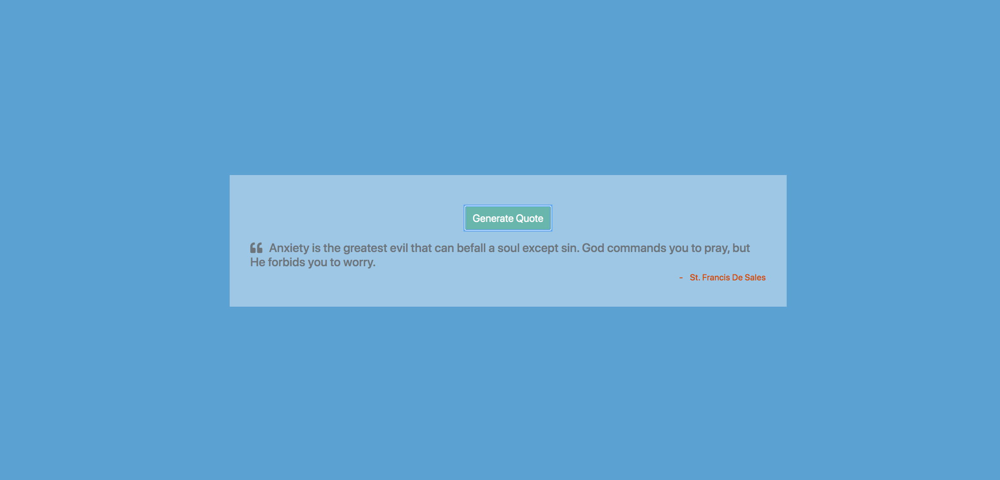

# Saintly-Quotes-Project

> A small JavaScript project that provides a random quote from a Catholic saint

## Demo

Here's a working live demo of the project: https://julianehiem.github.io/saintly-quotes/

## Tech/framework used

- [HTML](https://developer.mozilla.org/en-US/docs/Web/HTML)
- [CSS](https://developer.mozilla.org/en-US/docs/Web/CSS)
- [JS](https://developer.mozilla.org/en-US/docs/Web/JavaScript)

## Features

In additional to the foundational HTML, CSS and JS in this project, I also made use of a simple AJAX request to a local folder.

## Links

- Repository:https://github.com/JulianEhiem/saintly-quotes

## License

This project is licensed under the terms of the **MIT** license.

MIT © [JulianEhiem](https://github.com/JulianEhiem)
